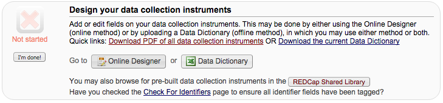
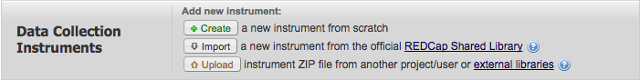

# Adverse Events and Concommitant Medications Forms

These forms provide a standards-based method of reporting Adverse Event and
Concommitant Medications on a clinical trial. They use REDCap's text auto-
completion and the MEDDRA, ATC, and RxNorm ontologies to provided assisted
text entry and validation of data entry. These features simplify the
aggregation and sharing of medication and adverse event data in clinical
trials.

Many of the questions on the Adverse Event form are tailored to mirror changes
currently in draft at the University of Florida Institutional Review Board.
Some changes to those questions should be expected when those changes are
released.

TODO: Add a field description in the each variable's annotation field to
describe the variable in a machine-parsable way.

## Requirements

These forms require the REDCap biomedical ontology features first released in
REDCap 6.7.0.  The forms were developed using REDCap 6.8.1.  Each of the forms
references ontologies served by http://data.bioontology.org  Access to that
service requires an API key from http://bioportal.bioontology.org/  No special
REDCap extensions are required.

## Installation

These forms are distributed as REDCap instruments. Each form is packaged in
its own zip file and has to be imported separately to get the full
functionality of the forms.  To download the latest instruments see
https://github.com/ctsit/ae_and_conmeds/releases/latest

After downloading the instruments you require from the above location, follow
these instructions to upload them into your REDCap instance

* Open your project
* Open 'Project Setup'

* Open 'Online Designer'

* Under 'Add new instrument', click on 'Upload'

* Choose one of the zip files containing the new instruments you just downloaded
* Click 'Upload Instrument ZIP'
* Repeat for other instruments if desired, otherwise you are done!!

## Contributors

These forms are based in part on work by Ken Bergquist done for the [HCV
Target](http://www.hcvtarget.org/) project.  The forms were adapted for use at
the University of Florida by Philip Chase <pbc@ufl.edu>, Ruchi V. Desai
<ruchivdesai@gmail.com> and Christopher P. Barnes <senrabc@gmail.com>.  Many
thanks to David Nelson, MD, Director of UF's Clinical Translational Science
Institute and Principal Investigator on the HCV Target project for his support
of this work.

## Contributions

We welcome contributions to these instruments.  The authoritative copy is on
Github at https://github.com/ctsit/ae_and_conmeds.  Please fork the repo at
Github, modify files as needed and submit a pull request.  For more details on
making contributions, please see the [Developers Notes](README-developer.md)

## License

See [LICENSE.txt](LICENSE.txt)
